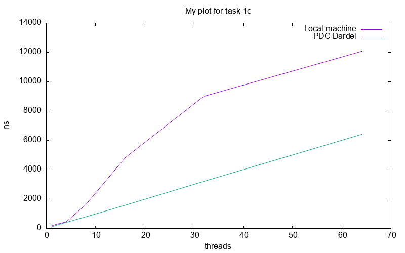

# Lab 1 - Basic Concurrency in Java

- Group X
- Lastname, Firstname and Lastname, Firstname

## Task 1: Simple Synchronization

### Task 1a: Race conditions

Source files:

- `task1/src/MainA.java` (main file)

To compile and execute:
```
javac src/MainA.java src/Utils.java
java src/MainA
```
In this task we expect the threads to overwrite each time the incremented value , with a final result being less then the result obtained if the program was to run sequentially .
### Task 1b: Synchronized keyword
Source files:

- `task1/src/MainB.java` (main file)

To compile and execute:
```
javac src/MainB.java src/Utils.java
java src/MainB
```
After adding the `synchronized` keyword, we prevent the threads from overwriting the variable. As a result, we now get a result similar to running the program sequentially.
### Task 1c: Synchronization performance

Source files:

- `task1/src/MainC.java` (main file)

To compile and execute:
```
javac src/MainC.java src/Utils.java
java src/MainC <N>
```
Where `N` is number of threads to execute with.


Figures 1 and 2 show heatmaps of the variance for variables X and Y. The highest variance for X occurs at X=3, while the lowest variance for Y is at Y=30. Therefore, using X=3 as a warmup value helps the system become more consistent in subsequent runs.


In figure 3, we see how the execution time scaled with the number of threads.
...



## Task 2: Guarded blocks using wait()/notify()

### Task 2A : Implement asynchronous sender-receiver

Source files:

- `task2/MainA.java` (main file)

To compile and execute:
```
javac MainA.java
java MainA
```

When executing it several times, we can see that printingThread prints different values every time (3737, 3679, 3320...). These values are low and far from 1000000, showing that both threads are executing asynchronously.

### Task 2B : Implement busy-waiting receiver 

Source files:

- `task2/MainB.java` (main file)

To compile and execute:
```
javac MainB.java
java MainB
```

This time, printingThread displays 1000000 every time, showing that it successfully waits for incrementingThread to finish before printing.

### Task 2C : Implement a waiting with guarded block

Source files:

- `task2/MainC.java` (main file)

To compile and execute:
```
javac MainC.java
java MainC
```

### Task 2D : Explore the effects of guarded block on performance

Source files:

- `task2/MainDB.java` (main file for program B)
- `task2/MainDC.java` (main file for program C)

To compile and execute:
```
javac MainDB.java MainDC.java
java MainDB
java MainDC
```

Measures for program B (in ns) :
```
34928, 40751, 38291, 24671, 36764, 40127, 58631, 43821, 33215, 37877, 36997, 38017
```

Measures for program C (in ns) :
```
44380, 40295, 21968, 44312, 19090, 37773, 41775, 21185, 23213, 43906, 18339, 23270
```

Means :
- `38674 ns` for program B
- `31625 ns` for program C

Considering that program C (guarded blocks) has to execute extra operations such as taking a lock to enter the `synchronized` block, we can see that using guarded blocks to implement a waiting globaly saves some time compared to a busy-waiting approach. But it seems to decrease the execution time only for some executions, whereas the others has times close to the mean of program B. We can thus deduce that the time saved by guarded blocks is dependant of the thread schedule chosen by JVM.

## Task 3: Producer-Consumer Buffer using Condition Variables

Source files:

- `task3/BufferClosedException.java`
- `task3/Buffer.java`
- `task3/Main.java` (main program)

To compile and execute:
```
javac Main.java
java Main
```

We have implemented a FIFO buffer with an array and two indexes :
- `producerIndex` pointing on the next available space of the array
- `consumerIndex` pointing on the next space to be read

If both indexes are equal it can means that the buffer is rather full, rather empty. Thus we have added another boolean variable `bufferEmpty` to distinguish those two cases.

A final boolean variable `bufferClosed` is here to handle buffer closure.

Condition variable `notFull` (respectively `notEmpty`) is used by producer thread (respectively consumer thread) to wait if buffer is full (respectively empty).

## Task 4: Counting Semaphore

Source files:

- `task4/src/CountingSemaphore.java`
- `task3/src/Main.java` (main program)

To compile and execute:
```
javac src/Main.java src/CountingSemaphore.java
java src/Main
```
In order to avoid any spurious wakeups, we used a variable to count the number of signal calls. When the count is negative, we keep checking it in a loop, so that once a thread is notified and asked to wake up, it will be able to proceed. If a spurious wakeup occurs, the loop ensures that the thread goes back to the wait state until the signal count is positive again.

To test our semaphore implementation, we created two simple programs: one that increments a value, demonstrating the semaphore acting as a classic lock, and another that leads to a deadlock scenario, illustrating potential pitfalls when semaphores are misused.
## Task 5: Dining Philosophers

Source files:

- `task5/Main.java` (main program)

To compile and execute:
```
javac MainA.java 
java Main
```

### Task 5a: First simulation
Using locks, we can simulate the scenario: when a philosopher wants to eat, they first lock the chopstick to their left, then the chopstick to their right. When the philosopher finishes eating and starts thinking, they release both locks.

When running the program, a deadlock occurs because each philosopher tries to acquire the chopsticks in the same order, leading to a circular wait. As the number of threads increases, contention also increases, making deadlocks more likely.

### Task 5b: First simulation
In order to debug the program , we have used jconsole in order to detect and understand the causes of the deadlocks . 

### Task 5c: First simulation
In order to prevent deadlocks, we tried to break the cycle by not allowing every philosopher to acquire the chopsticks in the same order; instead, one philosopher acquires them in the opposite order. However, this solution is not starvation-free, as a fast thread can acquire the locks every time, leaving the others waiting.
To address this, we introduced a notion of thread priority.
We count how many times each thread calls the eat() method and ensure that the difference between the most-called and least-called thread is always less than a certain integer value, by making the most-called thread busy-wait if necessary.